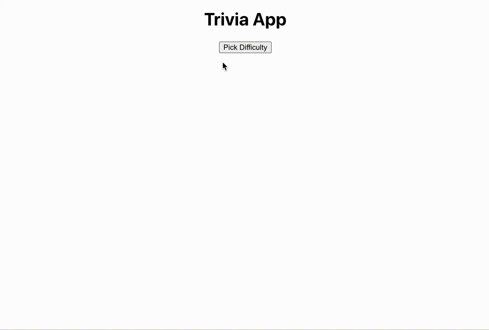

# Trivia_App

How to run Locally
1. clone repo
2. cd into repo 
3. install dependencies npm i
4.  `npm start` Runs the app in the development mode.\
Open [http://localhost:3000](http://localhost:3000) to view it in the browser.
  
